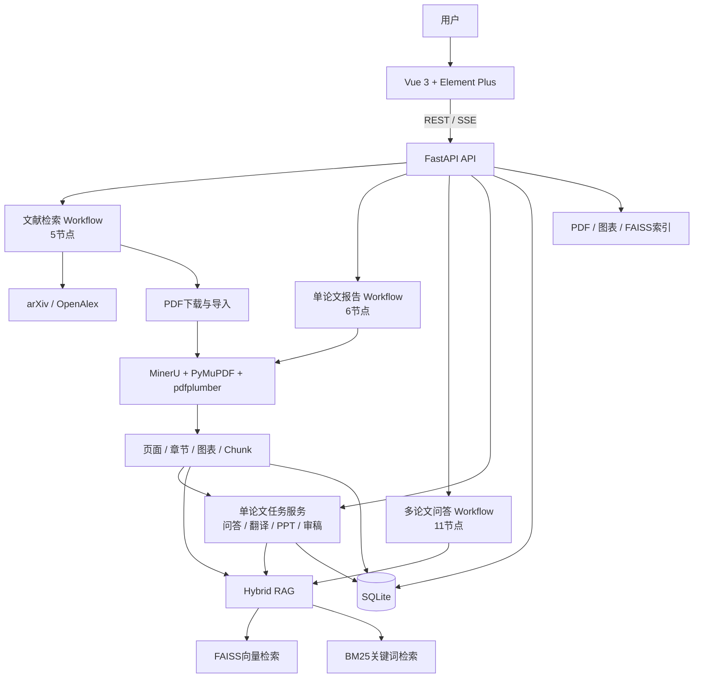
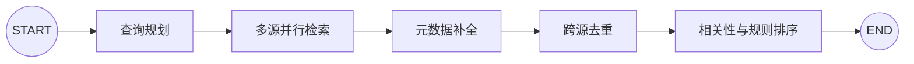
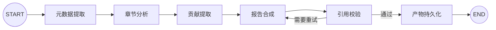
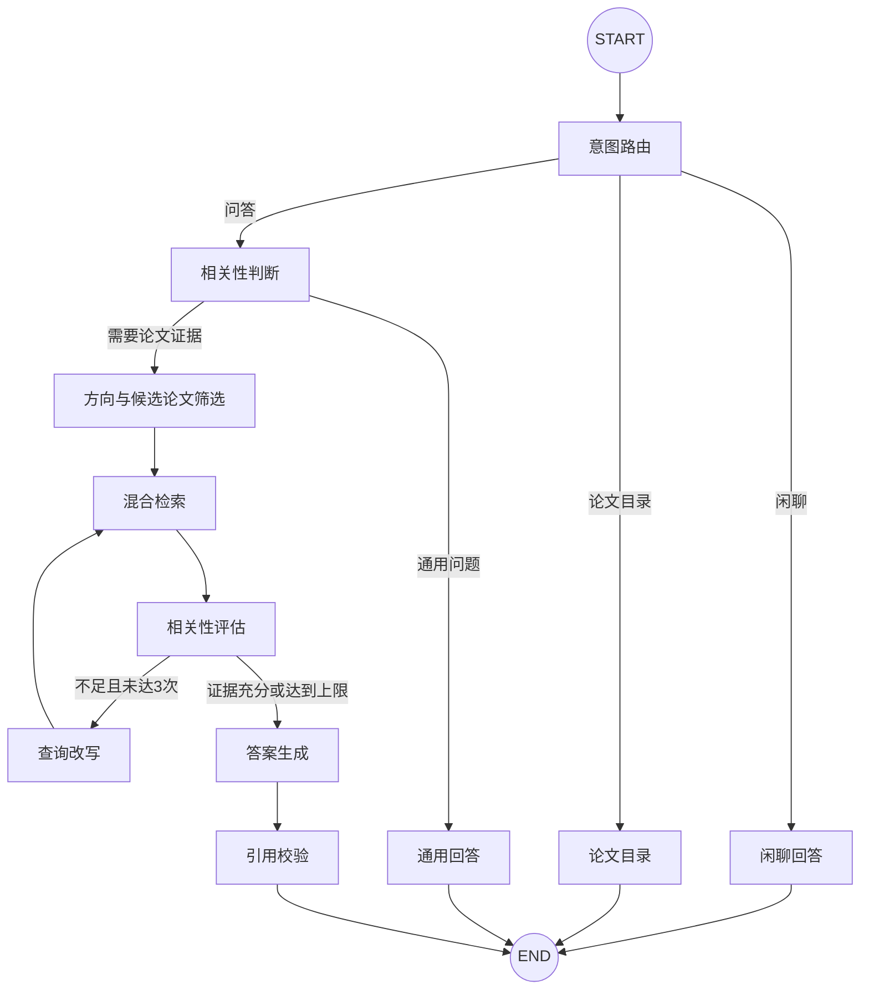

# 论文智答 · Academic Paper Agent

<p align="center"><strong>面向科研阅读的论文搜索、单论文深度研读与多论文 RAG 问答平台</strong></p>

<p align="center">
  
  
  
  
  
  
  
  
</p>

**论文智答**基于 FastAPI、Vue 3、LangGraph 与 Hybrid RAG 构建，围绕科研论文形成三条完整使用链路：

1. **文献搜索与下载**：规划检索词，聚合学术来源，完成去重、排序、PDF 下载和论文库导入。
2. **单论文深度研读**：上传 PDF 后自动解析章节、图表和页码，生成精读报告，并提供问答、翻译、PPT 与模拟审稿。
3. **多论文知识问答**：从论文库筛选候选论文，执行 FAISS + BM25 混合检索，生成带论文、章节和页码引用的回答。

> 本项目实现的是标准 **Hybrid RAG**，不是知识图谱 GraphRAG；核心是三套面向不同场景的 LangGraph Agent Workflow，并非多个自治Agent相互协商。

## 目录

- [项目截图](#项目截图)
- [核心能力](#核心能力)
- [系统架构](#系统架构)
- [三套 LangGraph Agent Workflow](#三套-langgraph-agent-workflow)
- [核心实现](#核心实现)
- [数据与索引存储](#数据与索引存储)
- [评测结果](#评测结果)
- [快速开始](#快速开始)
- [环境变量](#环境变量)
- [API 概览](#api-概览)
- [项目结构](#项目结构)
- [运行测试](#运行测试)
- [常见问题](#常见问题)
- [当前边界与后续规划](#当前边界与后续规划)
- [二次开发说明](#二次开发说明)

## 项目截图

### 论文库

上传论文后，系统自动完成解析、分块、索引和精读报告生成。论文可以按研究方向分组，也可以按标题、摘要和作者搜索。


### 单论文工作区

工作区同时展示章节树、精读内容和原始 PDF，支持报告、问答、章节翻译、汇报提纲与模拟审稿。


### 多论文问答与 Workflow 状态

问答页面通过 SSE 展示意图路由、方向选择、证据检索、相关性评估、查询改写、答案生成和引用校验状态。


## 核心能力

| 模块 | 用户能力 | 关键实现 |
|---|---|---|
| 文献搜索 | 搜索论文、筛选年份、查看元数据、下载并导入 | LangGraph 5节点、LLM查询规划、异步检索、元数据补全、跨源去重与排序 |
| 单论文报告 | 自动提取研究背景、动机、问题、方案与贡献 | LangGraph 6节点、结构化Prompt、引用校验、产物持久化 |
| 单论文问答 | 围绕当前论文多轮追问 | 当前论文独立索引、最近10条历史消息、SSE流式输出 |
| 章节翻译 | 按章节翻译正文与图表标题 | 章节层级展开、长文本分块、重叠去除、噪声清洗、分块持久化 |
| PPT生成 | 生成科研汇报页面与讲稿 | 证据检索、结构化Slides JSON、PptxGenJS前端导出 |
| 模拟审稿 | 生成优点、问题、评分和修改建议 | 全文证据召回、结构化审稿Prompt、引用校验 |
| 多论文问答 | 跨论文比较方法、实验与结论 | LangGraph 11节点、候选筛选、Hybrid RAG、自适应重试、引用校验 |
| 引用溯源 | 查看来源论文、章节、页码和原文片段 | 可信元数据注入、Chunk校验、页码纠正、PDF页码跳转 |
| 会话记忆 | 在同一会话中连续追问 | LangGraph State + SQLite消息持久化 + 最近10条历史注入 |

## 系统架构



```text
文献检索或本地上传 → PDF保存 → 版面与文本解析 → 页面/章节/图表/Chunk
    → 每篇论文独立构建FAISS+BM25索引 → 单论文任务或多论文检索
    → LLM基于证据生成 → 引用校验 → 论文/章节/页码/原文溯源
```

## 三套 LangGraph Agent Workflow

三套工作流共享 `State → Node → Edge` 的编排方式，但服务于不同业务。只有文献检索模块显式定义了 `SearchAgent` 类；另外两套通过状态类型、节点函数和编译后的 `StateGraph` 实现。

### 1. 文献检索 Workflow：5节点

代码入口：[`app/research/agent.py`](app/research/agent.py)



- LLM扩展检索词并选择来源，异常时退化为原查询直查。
- 多个来源与检索词组合异步请求，单个组合失败不会拖垮整批。
- OpenAlex补充arXiv结果的正式发表信息、Venue、CCF等级与被引量。
- 先按OpenAlex ID、再按标准化标题去重，合并预印本与正式版本。
- LLM相关性分级后，按已发表状态、CCF等级和被引量稳定排序。

当前默认检索来源是 **arXiv + OpenAlex**。仓库已实现并注入 Semantic Scholar Searcher，但尚未加入默认规划来源列表。

### 2. 单论文报告 Workflow：6节点

代码入口：[`app/paper/graph.py`](app/paper/graph.py)



该工作流专门负责结构化精读报告。论文问答、章节翻译、PPT和模拟审稿由 `PaperService` 的任务系统提供，不是6节点图中的独立节点。

### 3. 多论文问答 Workflow：11节点

代码入口：[`app/paper/library_graph.py`](app/paper/library_graph.py)



检索相关性不足时，通过 `Conditional Edge` 进入查询改写并重新召回；最多重试3次，避免无限循环。

## 核心实现

### 多源文献检索与下载

文献检索不只是调用一个搜索API，而是一条包含规划、检索、补全、去重、过滤和排序的完整链路。

- 支持关键词、年份区间、分页和刷新。
- 首次查询预取更深结果并建立短期缓存，翻页时直接切片，减少重复LLM规划和外部请求。
- DOI缺失时使用标准化标题去重；arXiv与OpenAlex重复时保留元数据更完整的版本。
- 多个来源或查询组合异步执行，部分来源异常时保留其他来源结果。
- PDF下载完成后创建导入任务，自动进入论文解析、索引和报告生成。
- 免费全文查找覆盖arXiv、ACL、PMLR、NeurIPS、OpenReview、AAAI、CVF与Unpaywall等来源；付费墙场景提供人工下载或浏览器辅助入口。

### PDF解析、章节与图表处理

代码入口：[`app/paper/parser.py`](app/paper/parser.py)、[`app/paper/figures.py`](app/paper/figures.py)、[`app/paper/service.py`](app/paper/service.py)

1. 原始PDF使用UUID前缀保存，避免同名文件覆盖。
2. MinerU提供版面块、标题层级、图表区域和公式等结构信息。
3. PyMuPDF与pdfplumber提取逐页文本、PDF元数据和页面坐标。
4. 章节审计识别正文误判标题、标题粘连和编号异常；LLM失败不会阻断主流程。
5. 图表检测优先复用MinerU结果，失败时回退启发式检测，并按坐标裁剪为图片。
6. 页面文本结合章节范围切分为Chunk，同时保存页码与字符区间。
7. Chunk写入SQLite，并用于构建该论文独立的检索索引。

### 分块翻译

- 选择父章节时包含父章节正文及其所有子章节；叶子章节只翻译当前章节。
- 根据页面字符区间去除相邻Chunk的重叠内容，避免重复翻译。
- 清理页顶页码、图注、图内文字和高数字占比表格行。
- 相邻短块在长度允许时合并，长章节拆为多个翻译单元。
- 每个翻译单元通过SSE返回并写入 `paper_translation_blocks`，页面刷新后可以恢复。
- 同一页范围内的图表标题单独翻译，并保留图片与原图注。

### Hybrid RAG

代码入口：[`app/rag/retriever.py`](app/rag/retriever.py)、[`app/paper/retriever.py`](app/paper/retriever.py)

```text
Query
  ├─ Embedding → FAISS语义检索 ─┐
  └─ 分词/字符切分 → BM25检索 ──┤
                                 ↓
                         Min-Max分数归一化
                                 ↓
                    向量0.7 + 关键词0.3融合
                                 ↓
                              Top-K
```

- FAISS使用归一化向量与内积索引，实现余弦相似度语义召回。
- BM25对英文按词、中文按字符切分，补充专有名词、缩写和精确关键词召回。
- 两路分数分别进行Min-Max归一化后加权融合，权重可通过环境变量调整。
- Embedding服务异常时自动降级到BM25-only，避免整个问答链路不可用。
- 每篇论文以 `paper_id` 为目录独立构建索引；删除或重建论文不会影响其他论文。
- 单论文问答只检索当前论文；多论文问答先筛选候选论文，再逐篇召回并合并证据。

### 可信引用与页码溯源

系统将引用视为可校验的数据，而不是仅在答案末尾拼接文件名。

单论文任务采用以下校验流程：

1. 后端只向模型提供当前论文的可信 `paper_id`、`chunk_id` 与页码范围。
2. 模型生成答案时返回结构化引用，包含论文、证据块、页码和原文摘录。
3. `CitationValidator` 校验论文与文本块是否真实存在。
4. 对引用原文做归一化精确匹配，并根据证据块元数据纠正或补全页码。
5. 引用不合格时触发一次定向修正；仍无法验证的引用不会伪装成可靠证据。

多论文问答则由回答生成节点输出候选论文与证据块，引用校验节点检查 `paper_id` 和 `evidence_chunk_ids` 是否属于本轮召回集合。前端可根据引用定位论文、页码和证据原文。

### 会话记忆

当前实现通过以下机制管理问答上下文：

- **Workflow State**：保存单次运行中的问题、候选论文、检索证据、重试次数和节点结果。
- **SQLite会话消息**：按 `paper_id + session_id` 隔离保存用户与助手消息，刷新页面后仍可恢复。
- **滑动窗口上下文**：默认取最近10条历史消息注入问答Prompt，兼顾多轮指代解析与上下文长度。

该方案重点解决论文工作区之间的上下文串扰。当前版本尚未实现摘要压缩和跨会话用户画像，相关能力列在后续规划中。

### SSE流式输出与Workflow可观测

- 单论文任务通过任务事件流持续推送排队、运行、完成和失败状态。
- 单论文问答与多论文问答均支持SSE流式返回，减少长回答等待感。
- 多论文Workflow将节点状态、候选论文、检索数量、改写次数和引用结果同步到前端。
- 前端工作流面板以时间线展示节点执行过程，便于观察检索不足、Query重写和引用校验等关键环节。

主要事件接口包括 `/papers/{paper_id}/events`、单论文任务流和 `/papers/qa/stream`。

## 数据与索引存储

默认运行数据保存在项目的 `data/` 目录：

```text
data/
├─ graphrag.db                         # SQLite：论文、任务、消息、引用等结构化数据
└─ papers/
   ├─ files/
   │  └─ {uuid}_{filename}.pdf         # 上传后的原始PDF
   ├─ figures/
   │  └─ {paper_id}/*.png              # 从论文中提取的图表
   └─ index/
      └─ {paper_id}/
         ├─ faiss.index                # FAISS向量索引
         └─ chunks.pkl                 # 文本块、页码和元数据
```

| 数据 | 保存位置 | 说明 |
|---|---|---|
| 原始论文 | `data/papers/files/` | 使用UUID前缀避免重名覆盖 |
| 章节、任务、对话、引用 | `data/graphrag.db` | SQLAlchemy异步访问SQLite |
| 论文图表 | `data/papers/figures/{paper_id}/` | 供报告与PPT生成复用 |
| 向量索引 | `data/papers/index/{paper_id}/faiss.index` | 每篇论文独立索引 |
| 文本块 | `data/papers/index/{paper_id}/chunks.pkl` | 包含原文、页码与章节元数据 |
| BM25索引 | 运行时内存 | 从 `chunks.pkl` 重建，无单独索引文件 |

> “每篇论文独立索引”表示物理文件按 `paper_id` 分目录保存，单论文检索限定当前论文；它不是权限隔离或多租户安全边界。

## 评测结果

项目评测覆盖意图路由、指定论文选择、Hybrid RAG、单论文问答、会话记忆和多论文问答，共 **117条用例**。以下数据来自当前仓库评测脚本与真实模型调用，不是人工主观估算。

### 评测概览

| 模块 | 用例数 | 核心结果 |
|---|---:|---|
| 意图路由 | 40 | Accuracy **80.0%** |
| 指定论文选择 | 25 | Target Recall **96.0%**；Exact-single **64.0%** |
| 检索评测 | 36 | Hybrid Hit@5 **91.7%**；MRR **0.7431** |
| 单论文问答 | 8 | 正确性 **5.00/5**；忠实性 **4.875/5**；引用验证率 **83.3%** |
| 会话记忆 | 5 | **5/5通过** |
| 多论文问答 | 3 | 正确性 **3.67/5**；忠实性 **4.33/5**；引用验证率 **87.5%** |

### 检索效果

| 检索方式 | Hit@1 | Hit@3 | Hit@5 | MRR | NDCG@5 | P50延迟 | P95延迟 |
|---|---:|---:|---:|---:|---:|---:|---:|
| BM25 | 38.9% | 58.3% | 61.1% | 0.4685 | 0.2253 | 0.46 ms | 8.23 ms |
| Hybrid RAG | **61.1%** | **88.9%** | **91.7%** | **0.7431** | **0.4285** | 708.29 ms | 1685.64 ms |

Hybrid RAG相较BM25的Hit@5提升 **30.6个百分点**。代价是需要调用Embedding服务，因此延迟明显高于纯关键词检索。

### 回答质量与引用

| 任务 | 正确性 | 相关性 | 忠实性 | 其他指标 | 引用验证率 | 延迟 |
|---|---:|---:|---:|---:|---:|---:|
| 单论文问答（8条） | 5.00/5 | 5.00/5 | 4.875/5 | — | 20/24，**83.3%** | 平均11.41 s，P95 13.96 s |
| 多论文问答（3条） | 3.67/5 | 4.33/5 | 4.33/5 | 需求满足度3.67/5 | 14/16，**87.5%** | P50 43.44 s，P95 101.72 s |

评测注意事项：

- 回答质量由同系列的Qwen Plus模型担任Judge，结果用于项目迭代，不等同于人工专家评审。
- 多论文端到端样本目前只有3条，分数只能说明当前用例表现，不能外推为通用学术问答准确率。
- 延迟包含模型与Embedding API网络耗时，会随供应商负载、地区和论文长度变化。
- 引用验证率统计结构化引用中通过证据校验的比例，不代表所有生成事实均已被人工复核。

### 工程验证

- 后端回归测试：**598项通过**
- 前端工具测试：**25项通过**
- Vue生产构建：通过

## 快速开始

### 1. 环境要求

- Windows 10/11（当前脚本以Windows为主；核心后端可移植到Linux）
- Python **3.10**
- Node.js **18+**
- pnpm **9+**
- OpenAI兼容的LLM与Embedding API
- MinerU（用于高质量PDF解析；未安装或不可用时会回退到基础解析）

### 2. 克隆项目

```powershell
git clone https://github.com/TaiZiTao/academic_paper_agent.git
cd academic_paper_agent
```

### 3. 安装后端依赖

推荐使用独立虚拟环境：

```powershell
python -m venv venv
.\venv\Scripts\Activate.ps1
python -m pip install --upgrade pip
pip install fastapi uvicorn pydantic-settings sqlalchemy aiosqlite langgraph langgraph-checkpoint-sqlite langchain-openai faiss-cpu rank-bm25 pdfplumber pymupdf mineru loguru httpx beautifulsoup4 lxml python-multipart playwright
```

如需使用浏览器辅助下载开放获取论文，再安装Chromium：

```powershell
playwright install chromium
```

> 项目在Python 3.10环境下完成验证。若本机同时安装了多个Python，请确保安装依赖和启动服务使用的是同一个解释器。

### 4. 配置环境变量

复制示例配置：

```powershell
Copy-Item .env.example .env
```

最小可用配置示例：

```dotenv
LLM_API_KEY=your_api_key
LLM_BASE_URL=https://dashscope.aliyuncs.com/compatible-mode/v1
LLM_MODEL=qwen-plus

EMBEDDING_API_KEY=your_api_key
EMBEDDING_BASE_URL=https://dashscope.aliyuncs.com/compatible-mode/v1
EMBEDDING_MODEL=text-embedding-v4
```

请根据实际供应商修改模型名称和Base URL。Embedding维度由模型映射自动确定；更换Embedding模型后，应重新构建已有论文索引。

### 5. 启动后端

```powershell
.\venv\Scripts\python.exe run.py
```

默认地址：

- API：<http://127.0.0.1:8000>
- Swagger文档：<http://127.0.0.1:8000/docs>
- 健康检查：<http://127.0.0.1:8000/health>

项目通过 `run.py` 设置OpenBLAS线程数等运行参数，Windows环境下建议优先使用该入口。

### 6. 启动前端

打开新的PowerShell窗口：

```powershell
cd web
corepack enable
pnpm install --frozen-lockfile
pnpm dev
```

根据终端提示访问前端地址，通常为 <http://127.0.0.1:5173>。

生产构建：

```powershell
pnpm build
```

## 环境变量

| 变量 | 默认值/示例 | 作用 |
|---|---|---|
| `LLM_API_KEY` | — | OpenAI兼容LLM密钥 |
| `LLM_BASE_URL` | DashScope兼容地址 | LLM服务地址 |
| `LLM_MODEL` | `qwen-plus` | 报告、翻译、问答与审稿模型 |
| `EMBEDDING_API_KEY` | 可复用LLM密钥 | Embedding服务密钥 |
| `EMBEDDING_BASE_URL` | DashScope兼容地址 | Embedding服务地址 |
| `EMBEDDING_MODEL` | `text-embedding-v4` | 向量模型 |
| `RETRIEVAL_VECTOR_WEIGHT` | `0.7` | Hybrid RAG向量分数权重 |
| `RETRIEVAL_KEYWORD_WEIGHT` | `0.3` | Hybrid RAG关键词分数权重 |
| `RETRIEVAL_TOP_K` | 项目配置值 | 默认召回数量 |
| `DATABASE_URL` | SQLite数据库 | 结构化数据连接地址 |
| `DATA_DIR` | `data` | PDF、图表与索引根目录 |

完整字段与默认值请以 [`.env.example`](.env.example) 和后端配置类为准，切勿提交真实API Key。

## API 概览

所有业务接口统一挂载在 `/api/v1` 下，完整请求与响应结构请以启动后的Swagger文档为准。

### 论文管理与单论文任务

| 方法 | 路径 | 说明 |
|---|---|---|
| POST | `/api/v1/papers` | 上传PDF并异步解析、构建索引 |
| GET | `/api/v1/papers` | 分页、搜索、按研究方向分组查询论文 |
| GET | `/api/v1/papers/{paper_id}` | 获取论文、章节、产物、对话和图表 |
| GET | `/api/v1/papers/{paper_id}/events` | 订阅论文处理进度 |
| POST | `/api/v1/papers/{paper_id}/tasks/stream` | 执行翻译、问答、PPT、审稿等SSE任务 |
| GET | `/api/v1/papers/{paper_id}/pdf` | 在线查看原始PDF |
| DELETE | `/api/v1/papers/{paper_id}` | 删除论文及关联数据 |

### 多论文问答

| 方法 | 路径 | 说明 |
|---|---|---|
| POST | `/api/v1/papers/qa/stream` | 运行多论文LangGraph Workflow并流式返回 |
| GET | `/api/v1/papers/qa/history` | 按 `session_id` 加载问答历史 |

### 文献检索与导入

| 方法 | 路径 | 说明 |
|---|---|---|
| POST | `/api/v1/research/search` | 多源检索、去重、排序并以SSE返回 |
| POST | `/api/v1/research/imports` | 创建论文下载与导入任务 |
| GET | `/api/v1/research/imports` | 查询导入任务列表 |
| GET | `/api/v1/research/imports/{import_id}` | 查询单个导入任务 |
| POST | `/api/v1/research/imports/{import_id}/retry` | 重试失败的导入任务 |
| GET | `/api/v1/research/browser/status` | 查询浏览器辅助下载状态 |

## 项目结构

```text
academic_paper_agent/
├─ app/
│  ├─ api/                    # 依赖注入与原知识库兼容接口
│  ├─ config/                 # pydantic-settings配置
│  ├─ database/               # 异步数据库与模型
│  ├─ graph/                  # 原RAG Workflow相关代码
│  ├─ memory/                 # 会话记忆基础能力
│  ├─ paper/                  # 论文模型、服务、路由与3套Workflow
│  ├─ parser/                 # PDF解析和文本清洗
│  ├─ rag/                    # FAISS、BM25与混合检索
│  ├─ research/               # 文献搜索Agent、数据源适配与下载
│  ├─ services/               # LLM、Embedding等通用服务
│  └─ utils/                  # 日志与公共工具
├─ web/
│  ├─ src/                    # Vue 3 + TypeScript前端
│  ├─ package.json
│  └─ pnpm-lock.yaml
├─ tests/                     # 后端单元、集成与评测测试
├─ scripts/                   # 评测和辅助脚本
├─ docs/                      # 设计、实现和评测文档
├─ data/                      # 本地数据库、PDF、图表与索引
├─ main.py                    # FastAPI应用入口
├─ run.py                     # Windows推荐启动入口
├─ .env.example
└─ README.md
```

## 运行测试

后端：

```powershell
.\venv\Scripts\python.exe -m pytest -q -p no:cacheprovider
```

前端工具测试：

```powershell
cd web
pnpm test
```

前端类型检查与生产构建：

```powershell
cd web
pnpm build
```

真实LLM与Embedding评测会消耗API额度，并可能把评测问题与论文证据发送给配置的模型服务商；运行前请检查测试标记、环境变量和数据合规要求。

## 常见问题

### 1. 已安装PyMuPDF，但仍提示缺少 `fitz`

通常是安装依赖与启动后端使用了不同Python解释器。分别执行 `python -c "import sys; print(sys.executable)"` 和 `.\venv\Scripts\python.exe -c "import fitz; print(fitz.__file__)"` 检查环境。

### 2. Windows启动时FAISS/OpenBLAS异常

优先通过 `run.py` 启动。该入口会在导入FAISS前限制OpenBLAS、OMP和MKL线程数，降低Windows环境的内存分配问题。

### 3. PDF长时间停留在解析中

MinerU首次运行可能加载模型，复杂扫描件也会明显变慢。检查后端日志、MinerU配置和论文处理事件流；失败状态可以通过重试接口重新处理。

### 4. 问答提示证据不足

确认论文状态已完成且索引文件存在。可以改用论文中的具体术语重新提问；多论文Workflow会在相关性不足时自动改写Query并重试，最多3次。

### 5. Embedding服务不可用时还能问答吗

检索器会降级为BM25-only，因此服务仍可返回结果，但语义召回效果通常会下降。恢复Embedding后建议重新确认索引模型与维度一致。

### 6. 为什么搜索结果默认没有Semantic Scholar

当前默认检索源是arXiv和OpenAlex。仓库已实现Semantic Scholar适配器，但没有加入默认规划列表；启用前建议补充限流、稳定性和授权策略。

### 7. SSE在代理后没有实时显示

检查Nginx或其他反向代理是否缓存响应，并关闭SSE路径的缓冲；客户端也应按事件边界消费 `text/event-stream`，不能等待响应整体结束。

### 8. 前端依赖应使用npm还是pnpm

仓库提交了 `web/pnpm-lock.yaml`，建议统一使用pnpm并执行 `pnpm install --frozen-lockfile`，避免依赖版本漂移。

## 当前边界与后续规划

当前版本已经形成从检索、下载、解析到问答和内容生成的完整闭环，但仍有以下工程边界：

- 项目是Hybrid RAG论文助手，不包含知识图谱构建、实体关系抽取和图检索。
- 三套Workflow由统一服务层协作，不涉及多个自治Agent之间的协商与任务分派。
- 文献检索默认只启用arXiv与OpenAlex；Semantic Scholar适配器尚未默认接入。
- 单论文会话记忆包含持久化消息与滑动窗口，尚未实现历史摘要、用户画像和跨论文偏好记忆。
- 多论文端到端评测样本量较小，需要扩充不同学科、不同语言和复杂比较问题。
- 本地SQLite与文件目录适合个人演示和中小规模使用；面向多人并发部署时应增加认证、权限、对象存储和外部数据库。
- 引用校验可以降低错误引用，但不能替代研究人员对原论文和实验结论的人工复核。

后续可优先扩充多论文评测集、引入Reranker、完善Semantic Scholar数据源、增加身份权限与任务队列，并为长会话增加摘要记忆。


## License

本项目采用 [MIT License](LICENSE)。

如果这个项目对你有帮助，欢迎Star、提交Issue或参与改进。
